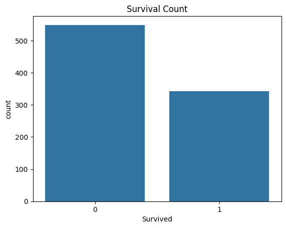
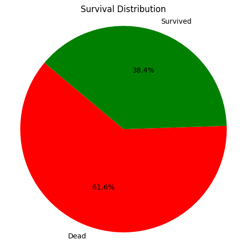

# 🏢 Afame Technologies - Data Analyst Internship Projects

This repository contains data analytics projects completed as part of the **Data Analyst Internship at Afame Technologies**.

# Titanic Survival Prediction 🚢

This project predicts whether a passenger survived the Titanic disaster using a machine learning model (Logistic Regression). The dataset is cleaned, visualized, and modeled to gain insights into survival patterns.

---

## 📊 Visualizations

### 🔵 Survival Count Plot

### 🟢 Survival Distribution Pie Chart

---

## 📁 Project Structure

- `titanic_survival_prediction.py` – Contains all the steps: cleaning, EDA, model building & evaluation.

## 📦 Dataset

- **File**: `Titanic-Dataset.csv`
- **Target**: `Survived` (0 = No, 1 = Yes)
- **Features**: `Pclass`, `Sex`, `Age`, `SibSp`, `Parch`, `Fare`, `Embarked`, etc.

## 🛠️ Libraries Used

- `pandas`, `numpy`
- `matplotlib`, `seaborn`
- `scikit-learn`

## 🔍 Steps Performed

1. **Data Cleaning**  
   - Filled missing values  
   - Dropped irrelevant columns  
   - Encoded categorical data  

2. **Exploratory Data Analysis (EDA)**  
   - Count plot & pie chart visualizations  
   - Analyzed survival by class and gender  

3. **Modeling**  
   - Logistic Regression  
   - Accuracy and classification report  

## 📈 Model Results

- **Accuracy**: ~ (insert model accuracy here)
- **Insights**:
  - Females had a higher survival rate.
  - Passengers in higher classes had better survival chances.

## ▶️ How to Run

1. Ensure the dataset and images are in the same directory.
2. Run `titanic_survival_prediction.py`.
3. Review printed outputs and plots.

---

## 🧑‍💻 About the Internship

These projects were completed as part of the **Afame Technologies Data Analyst Internship**. The objective is to apply real-world data analytics techniques and tools to analyze, visualize, and derive insights from business data.

📩 For assistance during the project, contact: [internship@afame.in](mailto:internship@afame.in)

---

⭐ **Thank you Afame Technologies for the opportunity!**

---

## 📬 Contact

For feedback or questions, feel free to reach out!
- 📧 Email: [your.email@example.com](dhudiyashyam84@gmail.com)
- 🔗 LinkedIn: [Shyam_Dhudiya](linkedin.com/in/shyam-dhudiya-75240b302)
